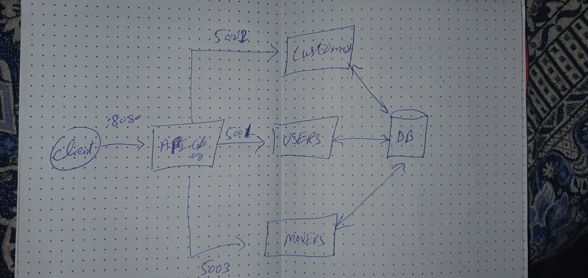
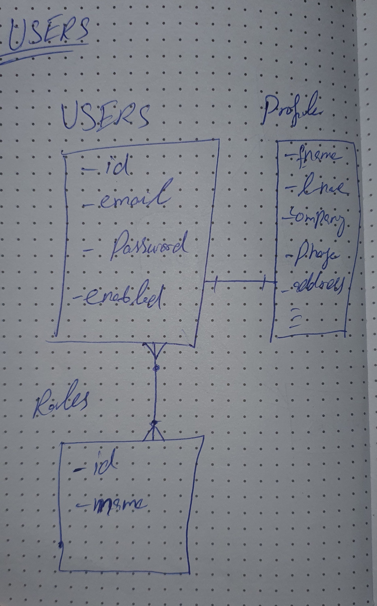
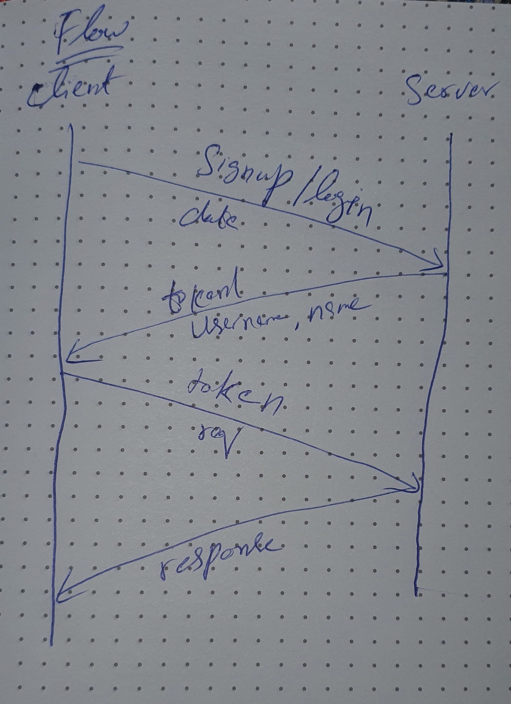
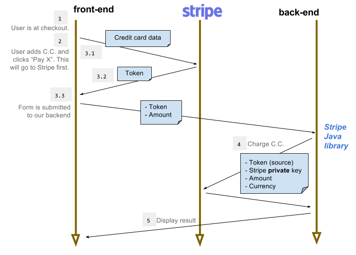
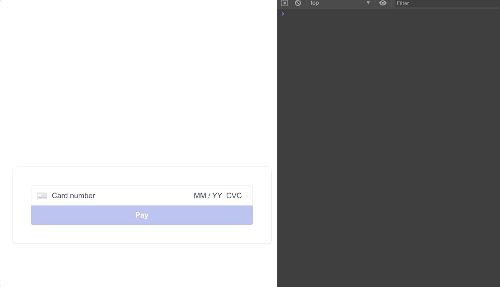

# GotMovers

<p align="center">
  <a href="#">
    
  </a>
</p>

<h3 align="center">GotMovers (A full-stack e-commerce website.)</h3>

## Table of contents

- [Architecture](#architecture)
- [Payment Gateway Architecture](#paymentarchitecture)
- [API](#api)
- [Developers](#developers)

## Technology Used

   - Spring boot is used for the backend Services.
   - React for font-end. 
   - Stripe for Credit Card Payments.
   - Spring Cloud API Gateway
   - Postgres is Used for the database. 
   - Docker to run the services. 
   - RestTemplate for inter-service Communication.
   - ELK for Logging. 
   - Swagger to Create API Documentation.
   
## General Approach

We discussed the architecture of the project and decided to use a database for the whole project. We figured out
how to proceed with the development and created the initial microservice architecture.


## Architecture
<details>

##### Rough Sketch of Architecture Diagram.


#### User Service Basics


#### User Flow Basic


</details>

#### Payment Gateway. 

[Stripe](https://stripe.com/) Gateway will be used to receive Payments. 

The best way is sending credit card info directly to Stripe using Stripe.js(React) library. Stripe servers are more secured than ours so the risk of stealing data is very small. 
```
The flow for such case is the following (and we will use it in our project):
    * Send data from web page to Stripe;
    * Stripe returns token;
    * Send token to backend server;
    * Charge credit card using token; 
```
Such approach has two benefits:
````
    * you don’t pass any sensitive data to your backend server
    * even if token will be intercepted by a man-in-the-middle he cannot retrieve any credit card info from this token
````
Payment Flow:



#### Front-End Example

React Stripe Checkout Front-end Example. 

2 Examples of Stripe React Integration has been created. 
Examples Directory:

```
...
.
├── billing-microservice
│   ├── paycard-test
│   │   ├── ...
│   ├── paycard-test2
│   │   ├── ...
...
```
You will need a Stripe account in order to run the demo. Once you set up your account, go to the [Stripe developer dashboard](https://stripe.com/docs/development#api-keys) to find your API keys.
Replace your key with .env in react project.

WARNING: Never attach Secret_Api key to front always use Publishable_Key.

```
REACT_APP_STRIPE_PUBLISHABLE_KEY=<replace-with-your-publishable-key>
```
<details>
<summary>
Example 1
</summary>



We using [createToken](https://stripe.com/docs/js/tokens_sources/create_token?type=cardElement)
 function from Stripe to send card to stripe servers and Get Token. 
```
const handleSubmit = async ev => {
    ...
    const response = await stripe.createToken(cardElement);  <----- Send Card to get Token from Strip. 
    //  const response = await stripe.createToken(cardElement, data);  <---- We can add Data object to send address to avoid Farud.
    if (response.error) {
      setError(`Payment failed ${response.error.message}`);
      setProcessing(false);
    } else {
      console.log(payload);     <----- Response Token
    }
  };
```
</details>

<details>
<summary>
Example 2
</summary>


Axios Post Call is used to fetch token for card. 
```
const handleSubmit = async ev => {
    ...
    const options = {
        method: 'POST',
        headers: { 'content-type': 'application/x-www-form-urlencoded' },
        params: {'key': stripePublishKey},   <---- Publish key attached. 
        data: qs.stringify(cardDetails),   <----- Send Card to get Token from Strip. 
        url: stripTokenUrl,
    };
    axios(options).then(res=>{
        console.log(res.data)   <----- Response Token
    }).catch(err => {
        console.log(err.response)
    })
```
</details>

Stripe Documentation Links to Help. 
* [Link 1](https://stripe.com/docs/payments/integration-builder)
* [Link 2](https://stripe.dev/react-stripe-elements/#card)
* [Test Cards](https://stripe.com/docs/testing#cards)


## API
```text
Base URL: /, Version: 1.1

Default request content-types: application/json , application/xml

Default response content-types: application/json , application/xml

Schemes: http 
```


